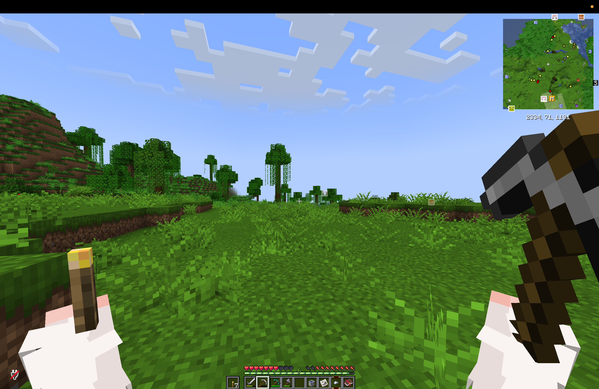
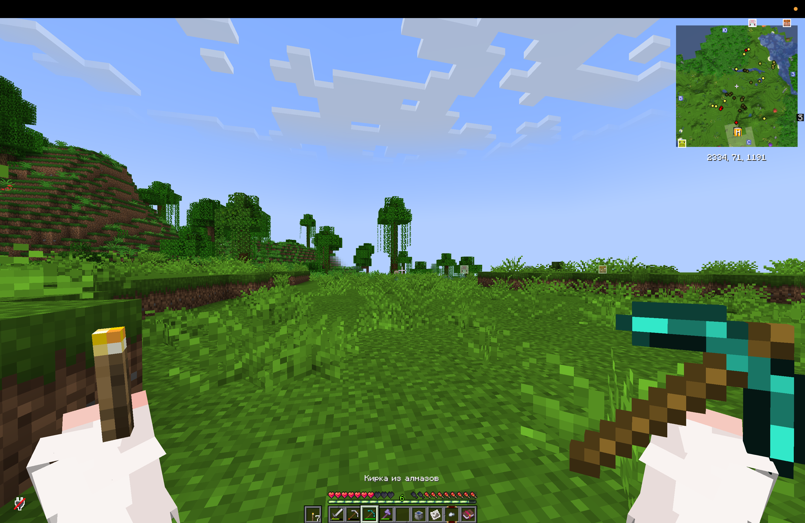
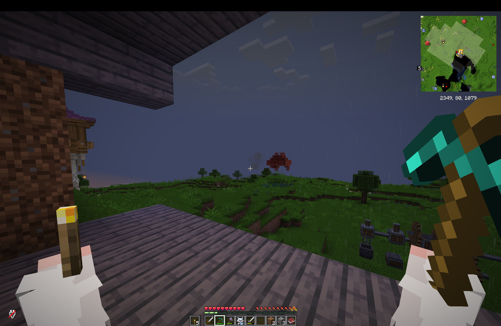

# Hold My Items Reforged: Silent Gear & modded tools fix

[](https://www.minecraft.net/)
[](https://neoforged.net/)
[](https://www.curseforge.com/minecraft/mc-mods/hold-my-items-reforged)
[](LICENSE)

Compatibility patcher for **Hold My Items - Reforged 2.1 on Minecraft 1.21.1 NeoForge**.

**Download on [CurseForge](https://www.curseforge.com/minecraft/mc-mods/silent-gear-tool-compatibility)** | [Source code and GitHub releases](https://github.com/akorutant/holdmyitems-reforged-tool-compat)

It fixes modded tools, including **Silent Gear pickaxes, swords, axes and other tools**, being rendered as generic items instead of using the same HoldMyItems poses and animations as vanilla tools.

If a Silent Gear tool is held at the wrong angle, misses the visible-hand animation, or behaves differently from a vanilla tool in first person, this patch targets that issue.

## Screenshots

The patch makes Silent Gear tools use the same first-person hand positioning and animations as vanilla tools.

| Vanilla pickaxe | Silent Gear before the fix | Silent Gear after the fix |
|---|---|---|
|  |  |  |

## Easy install

No terminal is required:

1. Download [`holdmyitemsnf-1.21.1v2.1-tool-compat.jar`](https://www.curseforge.com/minecraft/mc-mods/silent-gear-tool-compatibility/files/8574492) from CurseForge. If the project is still awaiting moderation, use the [GitHub release](https://github.com/akorutant/holdmyitems-reforged-tool-compat/releases/tag/v1.0.0) instead.
2. Open the `minecraft/mods` folder for your launcher instance.
3. Remove `holdmyitemsnf-1.21.1v2.1.jar` from that folder, but keep a backup elsewhere.
4. Put the downloaded `holdmyitemsnf-1.21.1v2.1-tool-compat.jar` into `minecraft/mods`.
5. Restart Minecraft completely.

Do not keep the original and patched HoldMyItems JARs in the `mods` folder at the same time.

## Apply the patch yourself

1. Download `holdmyitems-reforged-tool-compat-patcher-1.0.0.jar` from the [latest release](../../releases/latest).
2. Put it next to a clean `holdmyitemsnf-1.21.1v2.1.jar` backup.
3. Open a terminal in that folder and run:

   ```shell
   java -jar holdmyitems-reforged-tool-compat-patcher-1.0.0.jar \
     holdmyitemsnf-1.21.1v2.1.jar \
     holdmyitemsnf-1.21.1v2.1-patched.jar
   ```

4. Move the patched JAR into `minecraft/mods` and remove the unpatched copy from that folder.
5. Restart Minecraft completely.

> Always keep the original HoldMyItems JAR as a backup. Java 21 is required.

## Root cause

The 1.21.1 NeoForge build checks the legacy `forge:tools` item tag. NeoForge 1.21 uses the common `c:tools` tag, which includes vanilla tools and tool categories registered by other mods. The renderer also requires tagged tools to report themselves as enchantable, which excludes some modular tools.

The patch:

1. changes the internal tool tag from `forge:tools` to `c:tools`;
2. removes the redundant enchantability gate after an item has already matched the tool tag.

No animation transforms or item renderers are replaced.

## Building

```shell
mvn package
```

The executable patcher is written to `target/holdmyitems-reforged-tool-compat-patcher-1.0.0.jar`.

## Compatibility

Validated with:

- Minecraft 1.21.1
- NeoForge 21.1.243
- Hold My Items - Reforged 2.1
- Silent Gear 4.2.1.1

The patcher intentionally checks the expected number of bytecode changes and fails instead of modifying unknown versions.

## Search keywords

Hold My Items Reforged fix, HoldMyItems Silent Gear compatibility, Silent Gear first-person animation, modded tools rendering fix, Minecraft 1.21.1 NeoForge tool animation.

## Attribution

Hold My Items - Reforged is created by Bene2212_ and is available on [CurseForge](https://www.curseforge.com/minecraft/mc-mods/hold-my-items-reforged). This compatibility project is unofficial and is not affiliated with the mod author.
